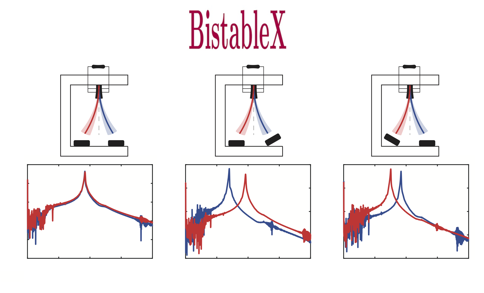

## Bistable eXploration in Energy Harvesting
**BistableX: Bistable eXploration in Energy Harvesting** is a comprehensive dataset comprising experimental measurements from a bistable energy harvester tested under both symmetric and asymmetric configurations. The repository includes frequency response data, power output records, state-space trajectories, and Poincaré maps that capture the nonlinear dynamic behavior of the system under varied excitation conditions. This dataset is intended to support research in nonlinear dynamics, energy harvesting, and structural health monitoring, providing a robust benchmark for validating new computational models.


<p align="center">

</p>

### Table of Contents
- [Overview](#overview)
- [Features](#features)
- [Usage](#usage)
- [Documentation](#documentation)
- [Reproducibility](#reproducibility)
- [Authors](#authors)
- [Citing BistableX](#citing-bistablex)
- [License](#license)
- [Institutional support](#institutional-support)
- [Funding](#funding)
- [Contact](#contact)
- [References using BistableX](#references-using-bistablex)

### Overview
**BistableX** was developed to conduct nonlinear analysis on bistable piezoelectric-magneto-elastic energy harvesters. The code functionalities are reported in the following publication:
- **J. P. Norenberg and P. S. Varoto and S. da Silva and A. Cunha Jr**, *Asymmetry-enhanced performance in bistable energy harvesters: An experimental study*, under review, 2025. <a href="http://dx.doi.org/xxx" target="_blank">DOI</a>

### Features
- **Extensive Experimental Data:** Data from a custom-designed bistable energy harvester, including measurements under symmetric and controlled asymmetric conditions (achieved via magnet rotation and base tilting).

- **Dynamic Characterization:** Frequency response functions (FRFs), power output measurements, and state-space reconstructions that reveal both monostable and chaotic behaviors.

- **Detailed Metadata:** Comprehensive documentation of test configurations, excitation parameters, and measurement protocols to ensure reproducibility.

- **Validation and Benchmarking:** Data suitable for validating numerical models and comparing the performance of energy harvesting strategies.

### Usage
To get started with **BistableX**, follow these steps:
1. Clone the repository:
   ```bash
   git clone https://github.com/yourusername/BistableX.git
   ```
2. Navigate to the package directory:
   ```bash
   cd BistableX
   ```
Detailed documentation, including a user manual and example scripts for data analysis (MATLAB), is available in the docs/ folder.

### Documentation
The repository includes extensive documentation that describes the experimental setup, data acquisition protocols, and data structure. Please refer to the docs/ directory for:

- The user manual
- Example analysis scripts
- Detailed metadata files

### Reproducibility
All experimental procedures and calibration details are documented to ensure reproducibility. The dataset comes with reproducible analysis scripts and a complete description of the measurement methodologies, making it straightforward to replicate the experiments or integrate the data into your own research.

### Authors
- João Pedro C. V. Norenberg
- Paulo Sergio Varoto
- Samuel da Silva
- Americo Cunha Jr

### Citing BistableX
If you use **BistableX** in your research, please cite the following publication:
- *J. P. Norenberg and P. S. Varoto and S. da Silva and A. Cunha Jr, Asymmetry-enhanced performance in bistable energy harvesters: An experimental study, under review, 2025*

```
@article{NorenbergEtAl2025_BistableX,
  author  = "{J. P. Norenberg and P. S. Varoto and S. da Silva and A. Cunha Jr}",
  title   = {Asymmetry-enhanced performance in bistable energy harvesters: An experimental study},
  journal = {under review},
  year    = {2025},
  volume  = {~},
  pages   = {~},
  doi     = {DOI_here},
}

```

### License

**BistableX** is released under the MIT license. See the LICENSE file for details. All new contributions must be made under the MIT license.

 

### Institutional support

 &nbsp; &nbsp;   &nbsp; &nbsp;   &nbsp; &nbsp;  

### Funding

 &nbsp; &nbsp;  &nbsp; &nbsp;  &nbsp; &nbsp;  

### Contact
For any questions or further information, please contact the authors at:

- João Pedro C. V. Norenberg: jpcvalese@gmail.com
- Paulo S. Varoto: varoto@sc.usp.br

### References using BistableX
The following references used **BistableX** to obtain their results. If you want to see your publication listed here, please contact us.

- *J. P. Norenberg and P. S. Varoto and S. da Silva and A. Cunha Jr, Asymmetry-enhanced performance in bistable energy harvesters: An experimental study, under review, 2025*
